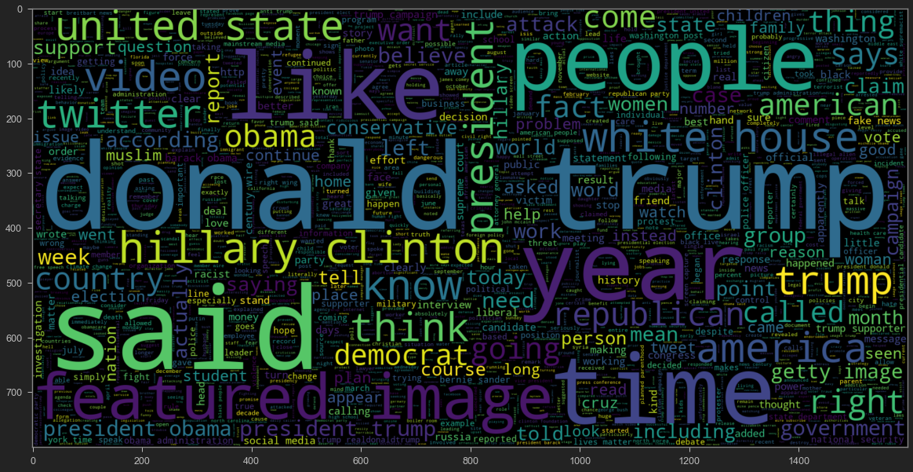

# Fake News Classification using LSTMs

Classifying news articles as real or fake using Natural Language Processing techniques.

<!--more-->

With the advent of the internet, the world has never been so informed. News can be shared across the globe within seconds through online sources such at news websites, blog posts, twitter etc. But, the grim reality is that there is a lot of misinformation and disinformation on the internet. Most recently, during the peak of the COVID-19 pandemic, misinformatino about vaccines spread like wildfire. Why don't we use NLP to combat this?

## 1. The Dataset
The dataset consists of news article gathers from some of the major sources in the United States such as The Washington Post, Reuters, New York Times, etc. These articles cover the following topics:
* Politics
* World News
* Government News
* Middle-east News

The structure of the dataset is:
* title: Title of the news article
* text: The content of the article (whole)
* subject: One of the above mentioned topics
* date: Date of publish
* isfake: A binary varible where 1 is Fake and 0 is Real

## 2. Data Cleaning
Each news article from the corpus was stripped down by removing the stopwords. The list of stopwords were obtained from the `nltk` and the `gensim` libraries.
```python
    # download stopwords
    nltk.download("stopwords")

    # Obtain additional stopwords from nltk
    from nltk.corpus import stopwords
    stop_words = stopwords.words('english')
    stop_words.extend(['from', 'subject', 're', 'edu', 'use'])

    gensim.parsing.preprocessing.STOPWORDS
```

The news article was tokenized and each token was checked against the list of stopwords. The remaining tokens were stored in a list and then joined to form a *clean* article.
```python
    # Remove stopwords and remove words with 2 or less characters
    def preprocess(text):
        result = []
        for token in gensim.utils.simple_preprocess(text):
            if token not in gensim.parsing.preprocessing.STOPWORDS and len(token) > 3 and token not in stop_words:
                result.append(token)
                
        return result
    df['clean'] = df['original'].apply(preprocess)
    df['clean_joined'] = df['clean'].apply(lambda x: " ".join(x))
```

## 3. Exploratory Data Analysis
To get a better understanding of the dataset, `WordCloud` was used to see the most frequently used terms in the fake and real news articles.

### Word Cloud for fake news
```python
    # plot the word cloud for text that is fake
    plt.figure(figsize = (20,20)) 
    wc = WordCloud(max_words = 2000 , width = 1600 , height = 800 , stopwords = stop_words).generate(" ".join(df[df.isfake == 1].clean_joined))
    plt.imshow(wc, interpolation = 'bilinear')
```


### Word Cloud for real news
```python
    # plot the word cloud for text that is fake
    plt.figure(figsize = (20,20)) 
    wc = WordCloud(max_words = 2000 , width = 1600 , height = 800 , stopwords = stop_words).generate(" ".join(df[df.isfake == 0].clean_joined))
    plt.imshow(wc, interpolation = 'bilinear')
```



## 4. Preparing data by tokenization and padding
Once the data is cleaned, I created train-test splits using `train_test_split` from the `sklearn` library. Then a Tokenizer from the `nltk` library was used to generate sequences of tokenized words.
```python
    tokenizer = Tokenizer(num_words = total_words)
    tokenizer.fit_on_texts(x_train)
    train_sequences = tokenizer.texts_to_sequences(x_train)
    test_sequences = tokenizer.texts_to_sequences(x_test)
```
Next, each sequence had to be padded to the maximum length of article in the news corpus.
```python
    padded_train = pad_sequences(train_sequences,maxlen = 4405, padding = 'post', truncating = 'post')
    padded_test = pad_sequences(test_sequences,maxlen = 4405, truncating = 'post') 
```

## 5. Building the Model
Now for the fun part!
The model I used for this task was a `Bidirectional LSTM` with 128 units. I had to use a bidirectional model because the length of these articles are quite long and so I wanted to capture long term dependencies from the *future* and the *past*. To train the model I used the `TensorFlow` framework. An `Embedding` layer was added before the BiLSTM layer to convert the sequences into Embeddings for the model to train on. Since this is a binary classification problem, the output layer has one unit with a `sigmoid` activation. The `adam` optimizer was used and the loss function was set to `binary_crossentropy`.

### Code
```python
    # Sequential Model
    model = Sequential()

    # embeddidng layer
    model.add(Embedding(total_words, output_dim = 128))
    # model.add(Embedding(total_words, output_dim = 240))


    # Bi-Directional RNN and LSTM
    model.add(Bidirectional(LSTM(128)))

    # Dense layers
    model.add(Dense(128, activation = 'relu'))
    model.add(Dense(1,activation= 'sigmoid'))
    model.compile(optimizer='adam', loss='binary_crossentropy', metrics=['acc'])
```

## 6. Training and Performance
The model was trained for 2 epochs with a validation split of 0.1 and a batch_size of 64. The trained model was then evaluated on the test set by obtaining the sigmoid outputs. If the value is greater than 0.5, classify as fake.

### Code
```python
    # train the model
    model.fit(padded_train, y_train, batch_size = 64, validation_split = 0.1, epochs = 2) 

    # if the predicted value is >0.5 it is real else it is fake
    prediction = []
    for i in range(len(pred)):
        if pred[i].item() > 0.5:
            prediction.append(1)
        else:
            prediction.append(0)
    
    # getting the accuracy
    from sklearn.metrics import accuracy_score

    accuracy = accuracy_score(list(y_test), prediction)

    print("Model Accuracy : ", accuracy)
    Model Accuracy :  0.9968819599109131
```

## 7. Results
With a test accuracy of `99.6%`, this model does a great job at detecting if a news article is real or fake.
