# H-1B Visa Analysis [R]

Analysis of President Trump's memos on the H-1B applications in the year 2017.

<!--more-->

## 1. Introduction

The H-1B is a temporary (non-immigrant) visa category that allows employers to petition for highly educated foreign professionals to work in “specialty occupations” that require at least a Bachelor’s degree or the equivalent. For a foreign national to apply for H-1B visa, a US employer must offer them employment and submit a petition for the visa to the US Immigration department (USCIS).

In 2016, Donald Trump won the presidential election to become the 45th President of the United States. In the following year, President Trump’s administration issued memos that were meant to clarify the existing H-1B applications process. It was not mandatory for the state governments to enforce these memos. Forbes posted an interesting article about a few policies that the president wanted to introduce. As an international student looking to gain work experience in the United States, the H-1B visa is a wonderful opportunity that enables me to achieve that goal. In this project, I want to explore the H-1B visa applications data for the years from 2015 to 2019 to see if the memo affected the application process and more broadly, observe how policy affects the process.

References:
- [American Immigration Council](https://www.americanimmigrationcouncil.org/research/h1b-visa-program-fact-sheet)
- [The Story of How Trump Officials Tried to End H-1B Visas](https://www.forbes.com/sites/stuartanderson/2021/02/01/the-story-of-how-trump-officials-tried-to-end-h-1b-visas/?sh=21b556b9173f)

## 2. Libraries

These are the libraries I used for this project:

``` r
library(knitr)
library(kableExtra)
library(ggplot2)
library(dplyr)
```

## 3. The Dataset

The dataset used for this analysis was downloaded from [Kaggle](www.kaggle.com) and is called the H-1B Visa Petitions 2015-2019 dataset. It contains five year’s worth of H-1B petition data, with around 860,000 records overall.

There are 13 columns in the dataset and they are explained as follows:
* `CASE_STATUS`: Status of the H-1B application
* `CASE_NUMBER`: Unique case identifier number
* `EMPLOYER_NAME`: The name of the employer as registered in the H-1B application
* `SOC_NAME`: The occupation name for the employment
* `SOC_CODE`: The occupation code for the employment
* `JOB_TITLE`: The job title of the employment
* `FULL_TIME_POSITION`: Whether the application is for full time roles
* `PREVAILING_WAGE`: The most frequent wage for the corresponding role
* `YEAR`: Year of application filing
* `WORKSITE`: The address of the employer worksite
* `WORKSITE_STATE_FULL`: The state of the employer worksite
* `WORKSITE_STATE_ABB`: The abbreviated state of the employer worksite
* `WORKSITE_STATE_CITY`: The city of the employer worksite

References:
- [H-1B Visa Petitions 2015-2019 dataset](https://www.kaggle.com/datasets/abrambeyer/h1b-visa-petitions-20152019)

## 4. Reading the data

``` r
df <- read.csv("~/Documents/Carnegie Mellon University/Semester - 3/Mini - 5/R/Final Project/h1b_kaggle_2019.csv",
                stringsAsFactors=TRUE)

# Dropping unnecessary columns like: WORKSITE_STATE_ABB, WORKSITE and CASE_NUMBER
df <- df[!names(df) == "WORKSITE_STATE_ABB"]
df <- df[!names(df) == "WORKSITE"]
df <- df[!names(df) == "CASE_NUMBER"]

# Converting YEAR into characters and factors
df$YEAR <- as.factor(as.character(df$YEAR))

# Renaming WORKSITE_STATE and WORKSITE_CITY to STATE and CITY
colnames(df)[8] <- "CITY"
colnames(df)[10] <- "STATE"

str(df)
```

### 1. Data Snippet

```r
head(df, 5) %>%
kable("html", escape = F, align = "c") %>%
kable_styling(bootstrap_options = c("striped", "hover", "condensed"), 
                full_width = F, font_size = 10)
```

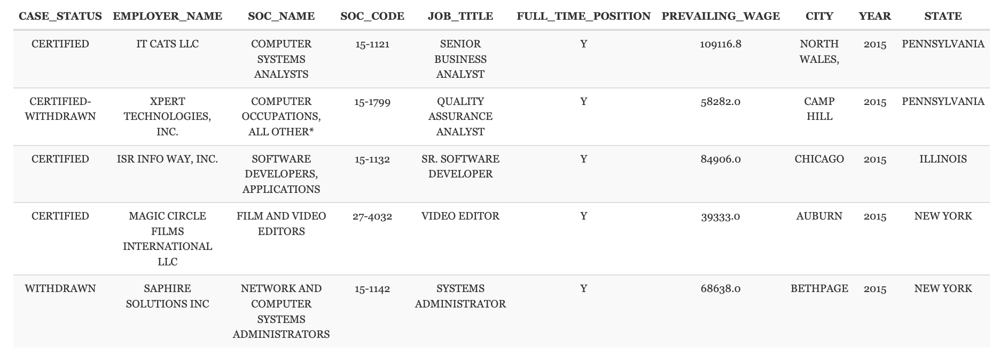

### 2. Data Cleaning

There are rows with missing data. Since there are around 860,000 rows of data, I chose to drop these rows instead of imputing the values.

```r
    # Checking and dropping rows with missing values:
    df <- na.omit(df)
    sum(is.na(df))
```

## 5. Number of H-1B applications filed from 2015 to 2019

To start a comparison of the H-1B visa process in the two years, it first makes sense to understand how many applications were filed in these years. The number of applications filed was fairly constant from 2015 to 2019 and hence, I believe that the comparison of data from 2015-2019 is fair.

```r
year_count <- df %>%
            group_by(YEAR) %>%
            summarise(COUNTS = n())

ggplot(year_count) + 
geom_bar(aes(YEAR, COUNTS/1000, fill=YEAR), stat = "identity") + 
geom_text(aes(YEAR, COUNTS/1000, label = paste(COUNTS))) + 
labs(x="Year", y="Number of applications filed (in thousands)", 
    title="Number of H-1B applications over the years") + 
theme(legend.position = "none")
```
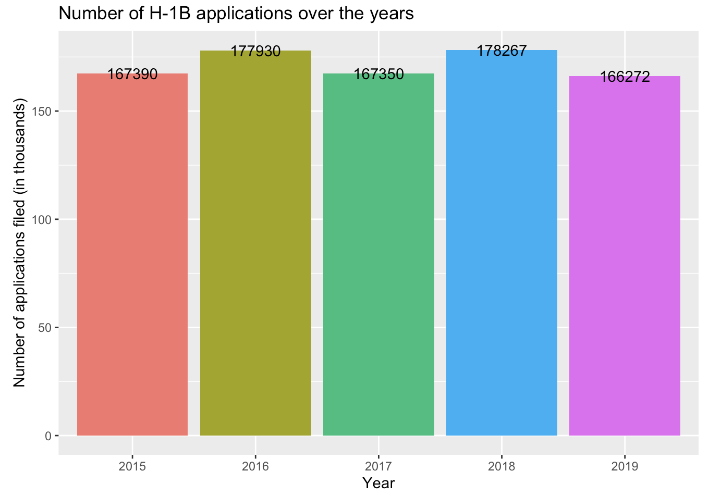

## 6. Number of applications by state

In continuation to the general exploration of data, let’s view the number of applications filed in each states to get an idea of which state is most willing to sponsor H-1B work visas.

```r
state_counts <- df %>%
            group_by(STATE) %>%
            summarise(COUNT = n(), .groups = "drop")

ggplot(data=state_counts) + 
geom_bar(aes(x=reorder(STATE, -COUNT), y=COUNT/1000, fill=STATE), stat="identity") + 
labs(x="States", y="Number of applications in thousands",
    title="Number of applications per state over the years") + 
theme(legend.position = "none")
```

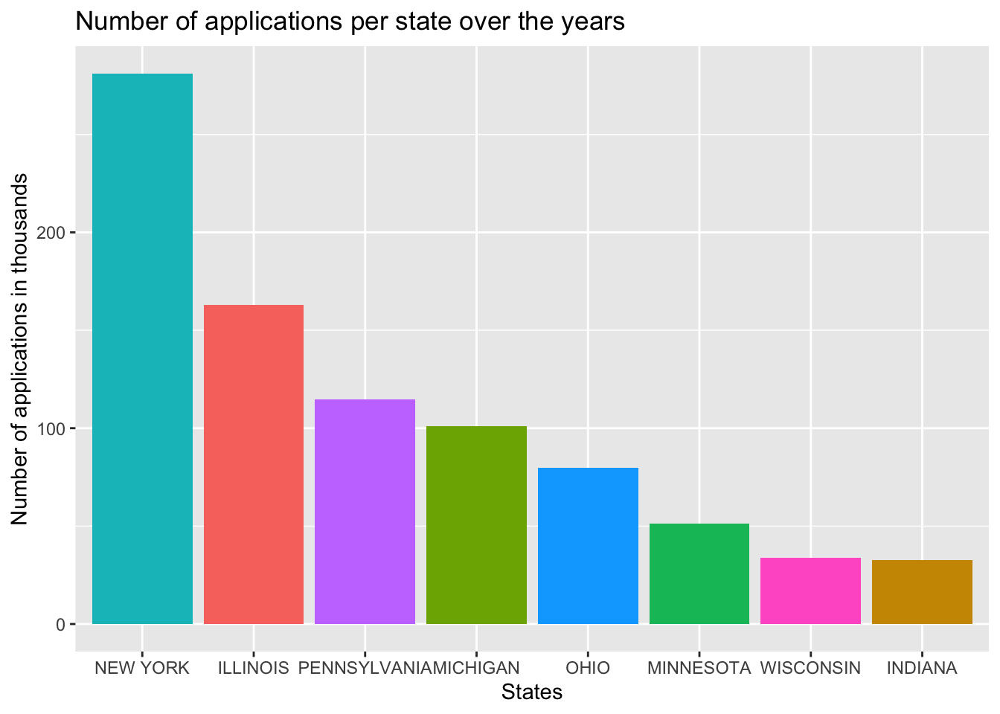

## 7. Distribution of Case Status

In 2017, President Trump’s administration introduced a memo that rescinded an older memo from December 2000 and took the position that entry-level computer programmers are not presumed to be eligible for H-1B visas. USCIS officials maintained that this was not a policy change but instead was meant to clarify the existing policy. Experts, however, said that the impact would likely lead to increased scrutiny of the H-1B petitions.

```r
case_stat_sum <- df %>%
                group_by(CASE_STATUS, YEAR) %>%
                summarise(TOTAL = n(), .groups = "drop")

case_stat_sum$YEAR <- as.numeric(as.character(case_stat_sum$YEAR))
props <- case_stat_sum %>%
        group_by(YEAR) %>%
        summarise(PERCENT = TOTAL*100/sum(TOTAL),
                CASE_GROUP = CASE_STATUS, .groups = "drop")

ggplot(data = props, aes(x = YEAR, y = PERCENT, color=CASE_GROUP)) +
    geom_line() + 
    geom_point() +
    facet_wrap(~CASE_GROUP, scales = "free_y") + 
    labs(x="Year", y="Applications (in %)", 
        title="Proportion of each type of case status over the years") + 
    theme(legend.position = "none")
```

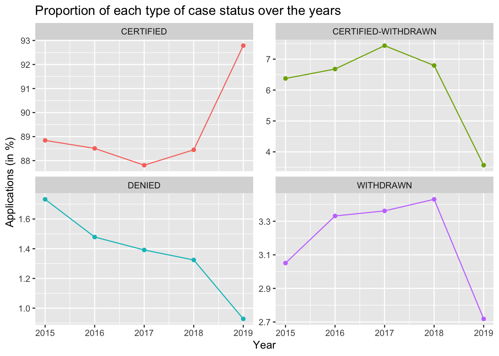

## 8. Occupation Code

From the plot below, we observe that overall, IT related occupations received substantially more H-1B petitions than the other fields. The top 5 specialty occupations are IT related and require some form of programming.

```r
occup_code <- df %>%
            group_by(SOC_NAME) %>%
            summarise(COUNT = n(), .groups = "drop") %>%
            top_n(n=20)

occup_code$SOC_NAME <- as.character(occup_code$SOC_NAME)
occup_code$SOC_NAME <- toTitleCase(tolower(occup_code$SOC_NAME))

ggplot(data=occup_code) + 
geom_bar(aes(x=COUNT/1000, y=reorder(SOC_NAME, COUNT), fill=SOC_NAME), stat = "identity") + 
labs(x="Applications (in thousands)", y="Speciality Occupation",
    title="Most popular Speciality Occupations") + 
guides(fill="none")
```

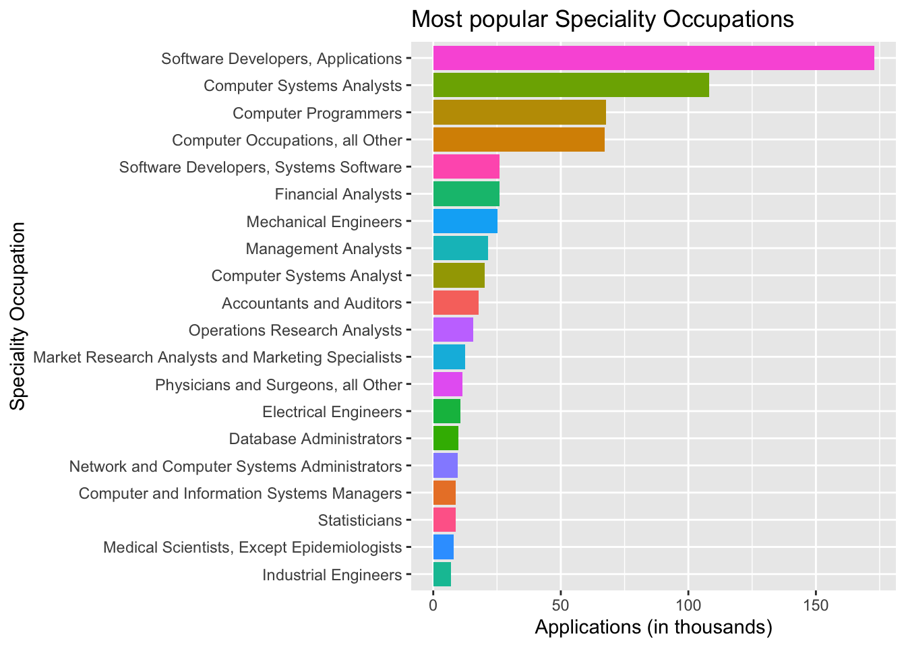


Since, the memo was directed towards IT related job roles, let us see if there was a decline in the certification of IT related occupation applications in 2017. A line plot tells us the trend over the years from 2015 to 2019.

```r
occup_rate <- df %>%
            filter(CASE_STATUS == "CERTIFIED") %>%
            group_by(YEAR, SOC_NAME) %>%
            summarise(COUNT = n(), .groups = "drop") 
occup_rate <- occup_rate %>%
            group_by(YEAR) %>%
            top_n(n=5)
occup_rate <- occup_rate %>%
            group_by(SOC_NAME) %>%
            filter(n() == 5)

occup_rate$YEAR <- as.numeric(as.character(occup_rate$YEAR))

ggplot(data = occup_rate, aes(x = YEAR, y = COUNT/1000, color=SOC_NAME)) +
    geom_line() +
    geom_point() +
    facet_grid(~SOC_NAME, labeller = label_wrap_gen(width = 10)) +
    labs(x="Year", y="Applications (in thousands)", 
        title="Trend in certified application over the years") + 
    theme(legend.position = "none")
```

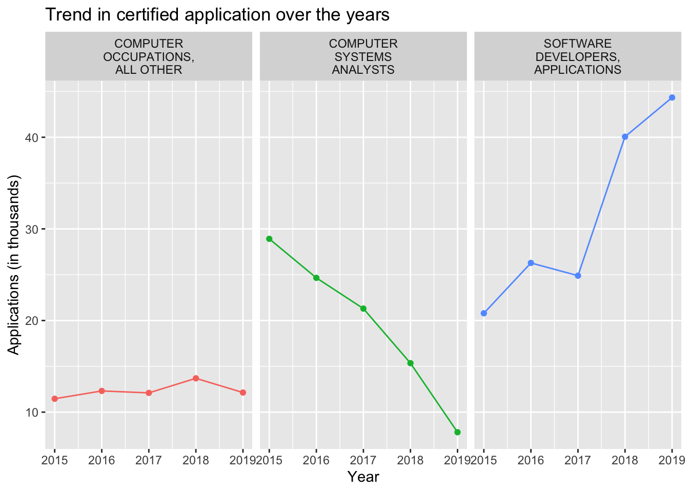


From the above plot, there is a slight drop in the number of certified applications in all three categories. The total number of H-1B applications filed in 2017 was less than that in 2016 but the difference was not significant. Moreover, in 2019, the number of H-1B applications filed was similar to that in 2017 and we see a meteoric rise for the `SOFTWARE DEVELOPERS, APPLICATIONS` SOC. The fact that there was a drop in the number of `SOFTWARE DEVELOPERS, APPLICATIONS` H-1B application confirms the effect of President Trump’s memo on the IT industry.

## 9. Was there a change in the number of applications for these positions over the years?

```r
occupations <- c("COMPUTER OCCUPATIONS, ALL OTHER", "COMPTUER SYSTEMS ANALYST", 
                "SOFTWARE DEVELOPERS, APPLICATIONS")

state_wise_applis <- df %>%
                    filter(SOC_NAME %in% occupations) %>%
                    group_by(YEAR, STATE, SOC_NAME) %>%
                    summarise(COUNT = n(), .groups = "drop")

state_wise_applis$YEAR <- as.numeric(as.character(state_wise_applis$YEAR))

ggplot(data=state_wise_applis, aes(x=YEAR, y=COUNT/1000, color=STATE)) + 
geom_point() + 
geom_line() + 
facet_wrap(~SOC_NAME, labeller = label_wrap_gen(width = 10)) + 
labs(x="Year", y="Number of applications in thousands", color="State",
    title="Trend in the number of applications for programming related occupations")
```

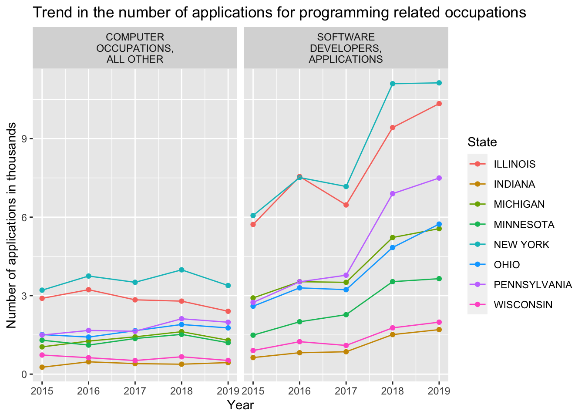
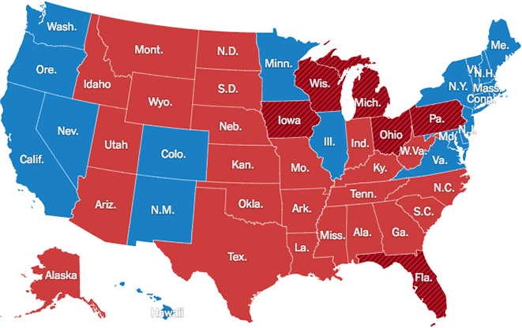

Out of the 8 states, 5 states saw a decline in the number of applications filed for the `SOFTWARE DEVELOPERS, APPLICATIONS` SOC. Hence, not all states followed the memo recommended by the president’s administration. Interestingly, out of the 5 states that saw a drop in the number of H-1B applications for this SOC, President Trump won the elections in 3 states. Furthermore, in the states where there was an increase in the number of applications, President Trump won in 2 states as can be seen from the map above. Hence, there does not seem to be a connection to the state’s political preference and the number of applications.

## 10. Part-time vs Full-time

Another potentially interesting effect of the memo could be the effect it had on the Part-time vs Full-time applicants. Due to more scrutiny, I expect the proportion of Part-time applications that are certified to be smaller in 2017 when compared to the other years, or at least, decline from the previous year. From the pie chart below, we notice that there is a decrease in the number of part time certification but the trend continues into 2018 and 2019. It is interesting to note that there were more part time certifications in 2016 than full time!

On doing more research, it turns out that USCIS reached the maximum cap for full time H-1B applications in 4/7/2015 and that no more applications would be accepted till October 2016. CMU’s Office of International Education posted an interesting update on this situation in 2015. Have a read [here](https://www.cmu.edu/oie/news-and-events/archives/2014-2015/april/h-2016.html).

```r
part_time <- df %>%
            filter(CASE_STATUS == "CERTIFIED") %>%
            group_by(YEAR, FULL_TIME_POSITION) %>%
            summarise(COUNT = n(), .groups = "drop")

part_time <- part_time %>%
            group_by(YEAR) %>%
            summarise(PERCENT = round(COUNT*100/sum(COUNT), 1),
                    COUNT = COUNT, 
                    FULL_TIME = FULL_TIME_POSITION, .groups = "drop")
ggplot(data=part_time) + 
geom_bar(aes(x="", y=PERCENT, fill=FULL_TIME), stat = "identity", width = 1, color="white") + 
geom_text(aes(x="", y=PERCENT, label=paste(PERCENT, "%")), 
            position = position_stack(vjust = 0.5)) + 
facet_wrap(~YEAR) + 
coord_polar("y", start=0) + 
labs(title="Proportion of Part time certified applications over the years", x="", y="") +
guides(fill=guide_legend(title = "Full Time")) + 
theme(axis.text = element_blank(),
        axis.ticks = element_blank(),
        panel.grid  = element_blank())
```

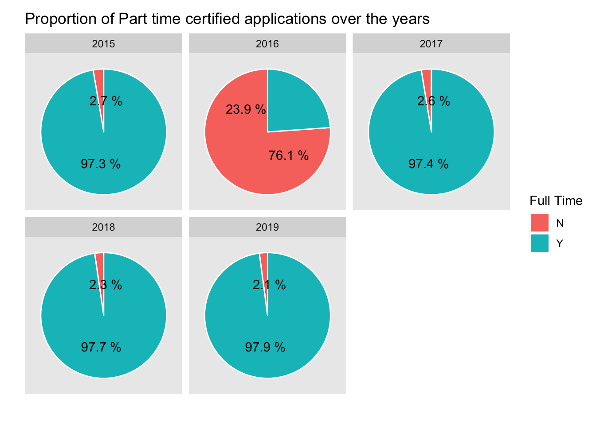

## 11. Effect of H-1B salary floor on the certification percentage

Another memo that President Trump’s administration introduced was to raise the minimum salary requirements for an individual to qualify for the visa. They proposed to raise it to $90,000. First, let’s see if this reflects in the data in the form of mean salaries over the years for all case statuses.

```r
salaries <- df %>%
        group_by(YEAR) %>%
        summarise(SALARY = PREVAILING_WAGE, 
                    MEAN_WAGE = mean(PREVAILING_WAGE), .groups = "drop")

ggplot(data=salaries) + 
geom_boxplot(aes(x=YEAR, y=SALARY/1000, fill=YEAR)) + 
ylim(0, 111) +
labs(title="Salaries over the years for all case categories", x="Year",
    y="Salary in thousands", color="Year") + 
geom_point(aes(x=YEAR, y=MEAN_WAGE/1000), shape=23, fill="blue", color="darkred", size=4) + 
theme(legend.position = "none")
```

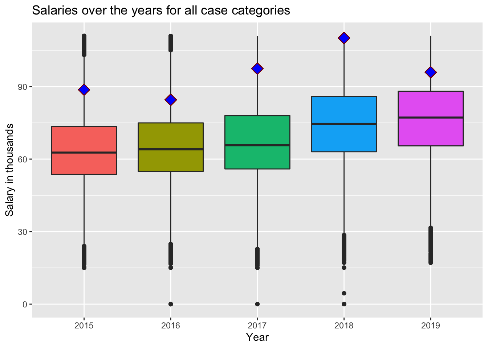

From the above plot, in general, there is an increase in the mean wage from 2015 to 2017. Lets perform a hypothesis test to see if there is a statistically significant difference in the mean of the wages in 2016 and 2017.

```r
test_data <- df %>%
            filter(YEAR %in% c(2016, 2017)) %>%
            group_by(YEAR) %>%
            summarise(SALARY = PREVAILING_WAGE, .groups = "drop")

t.test(test_data[test_data$YEAR == 2016, 2], test_data[test_data$YEAR == 2017, 2], conf.level=0.95)

## 
##  Welch Two Sample t-test
## 
## data:  test_data[test_data$YEAR == 2016, 2] and test_data[test_data$YEAR == 2017, 2]
## t = -2.2269, df = 310697, p-value = 0.02596
## alternative hypothesis: true difference in means is not equal to 0
## 95 percent confidence interval:
##  -24271.894  -1547.306
## sample estimates:
## mean of x mean of y 
##  84525.32  97434.92
```

Since the p-value is lower than the level of significance (0.05), we can say that there is a statistically significant difference between the salaries in year 2016 and 2017. Hence, President Trump’s policy did have a significant affect on the prevailing wages in 2017. The mean wages rose from $84,525 in 2016 to $97,434 in 2017.


## 12. Which companies sponsored H-1B visas the most, and was there a decline after the memos?

H-1B visas are sponsored by a company. It could be interesting to see if there was a decline in the number of applications filed by the company in 2017 for the SOFTWARE DEVELOPER, APPLICATIONS SOC. Since there are a large number of companies that sponsor visa, lets look at the top 10 companies for this specific occupation over all the years.

```r
company_nums <- df %>%
                filter(SOC_NAME == "SOFTWARE DEVELOPERS, APPLICATIONS") %>%
                group_by(EMPLOYER_NAME) %>%
                summarise(COUNT = n(), .groups = "drop") %>%
                top_n(n=10)

treemap(dtf=company_nums,
        index="EMPLOYER_NAME",
        vSize="COUNT",
        type="index",
        title="Companies that sponsored H-1B visas the most")
```

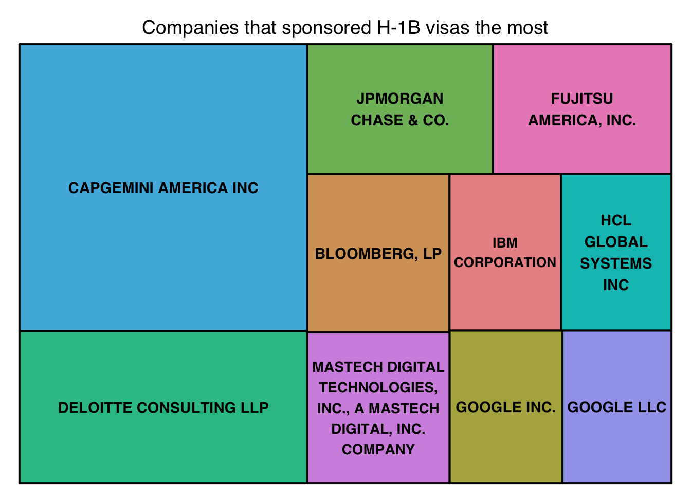

Over the years, Capgemini has sponsored the most number of H-1B visas for the `SOFTWARE DEVELOPERS, APPLICATIONS` SOC. Let’s see what the year-wise break-down looks like for 2016 and 2017.

```r
year_breakdown <- df %>%
                  filter(SOC_NAME == "SOFTWARE DEVELOPERS, APPLICATIONS" & 
                           YEAR %in% c("2016", "2017")) %>%
                  group_by(YEAR, EMPLOYER_NAME) %>%
                  summarise(COUNT = n(), .groups = "drop")

ordered_breakdowns <- year_breakdown %>%
                      group_by(YEAR) %>%
                      arrange(desc(COUNT)) %>%
                      head(20)

ordered_breakdowns$EMPLOYER_NAME <- str_wrap(ordered_breakdowns$EMPLOYER_NAME, width=30)

ggplot(ordered_breakdowns) + 
  geom_tile(aes(YEAR, EMPLOYER_NAME, fill=COUNT)) + 
  labs(x="Year", y="Employer name") + 
  scale_fill_gradient(low="lightblue", high="darkblue")
```

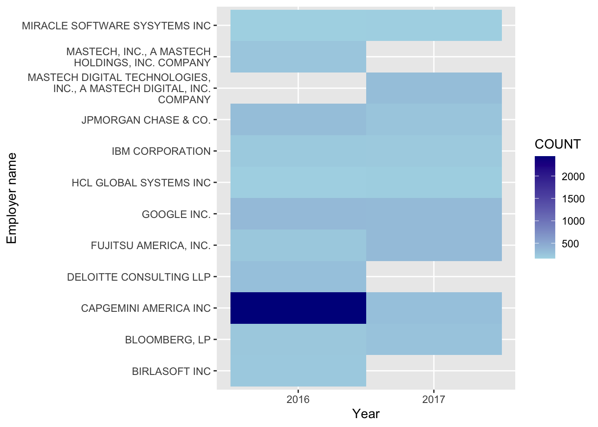

In 2017, Capgemini seems to have pulled back on filing H-1B applications where as some new companies like Mastech Digital Technologies began sponsoring visas. Furthermore, Birlasoft and Deloitte did not file any H-1B visas in 2017. JP Morgan also reduced the number of applications filed whereas Fujitsu increased slightly. From the above plot, we can say that the most sponsorship friendly companies in 2016 have been slightly more conservative in filing applications in 2017.

## 13. Conclusion and remarks

President Trump’s administration introduced a few memos in 2017 regarding the H-1B application qualification requirements. They were:
1. Advising against considering entry-level programming jobs as a special occupation
2. Raising the minimum wage requirement to $90,000

There was an observed decrease in the number of H-1B applications certified for the `SOFTWARE DEVELOPERS, APPLICATIONS` SOC in 2017. The minimum wage requirement memo did raise the mean wage to greater than $90,000 and the percent increase from the previous year was 15.27% which is much higher than the mean inflation rate in 2017 (2.1%).

President Biden has recently reinstated the previous policies and hence, in the future, with more recent data, it will be interesting to see if the numbers of applications filed certified in the IT related jobs have recovered.
